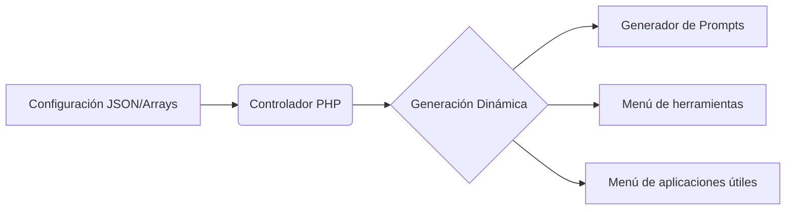

# 🤖 Integración de Módulo IA: Arquitectura y Prompt Engineering

> **Rol:** Desarrollador Full Stack / I+D. 
> 
> **Proyecto:** Extensión para la plataforma de gestión empresarial **Buzzo**.

Este proyecto consistió en el desarrollo de un módulo diseñado para facilitar la interacción de perfiles directivos con herramientas de Inteligencia Artificial. Aunque la implementación final se centró en una interfaz de formularios estáticos por requerimientos de gestión, el núcleo se diseñó bajo una **arquitectura modular** para permitir su escalabilidad futura.

---

## 🏗️ Arquitectura Basada en Datos (Modularidad)

Para evitar un desarrollo rígido, diseñé un sistema donde el contenido de las secciones no está "escrito a fuego" en el código, sino que se genera dinámicamente.

- **Estructura Modular:** Uso de controladores en PHP que procesan arrays y archivos JSON para renderizar cada sección de la herramienta.

- **Mantenibilidad:** Este enfoque permite añadir nuevas herramientas de IA o modificar los parámetros de los prompts sin necesidad de refactorizar el código principal.

- **Escalabilidad:** La arquitectura quedó preparada para integrarse directamente en el ecosistema de la aplicación Buzzo.

---

## 🛠️ Stack Tecnológico

- **Backend:** PHP para el procesamiento de lógica y controladores.

- **Frontend:** Implementación de interfaces dinámicas y consumo de datos.

- **Prompt Engineering:** Diseño de estructuras de consulta para optimizar resultados en modelos de lenguaje (LLMs).

---

## 💡 Análisis de Evolución y Criterio Técnico

Durante el desarrollo, realicé investigaciones y pruebas de concepto para elevar la capacidad del módulo más allá de los requisitos iniciales:

- **Investigación de APIs (Groq):** Realicé pruebas con la API de Groq para transicionar de formularios extensos a un modelo de **entrada única (Single-Input)**, procesando el lenguaje natural del usuario para generar prompts complejos automáticamente.

![[groq-docs.png]]Imagen de modelos disponibles en [Groq](https://console.groq.com/docs/models)

- **Seguridad y Privacidad:** En la fase de diseño, se consideró la gestión segura de API Keys en el servidor y la necesidad de políticas de privacidad para los datos corporativos enviados a modelos externos.

> [!info] Nota de honestidad 
> Aunque estas mejoras no se integraron en la versión final por decisión de la dirección, la fase de I+D permitió validar la viabilidad técnica de una integración más profunda y automatizada de la IA en la plataforma.
