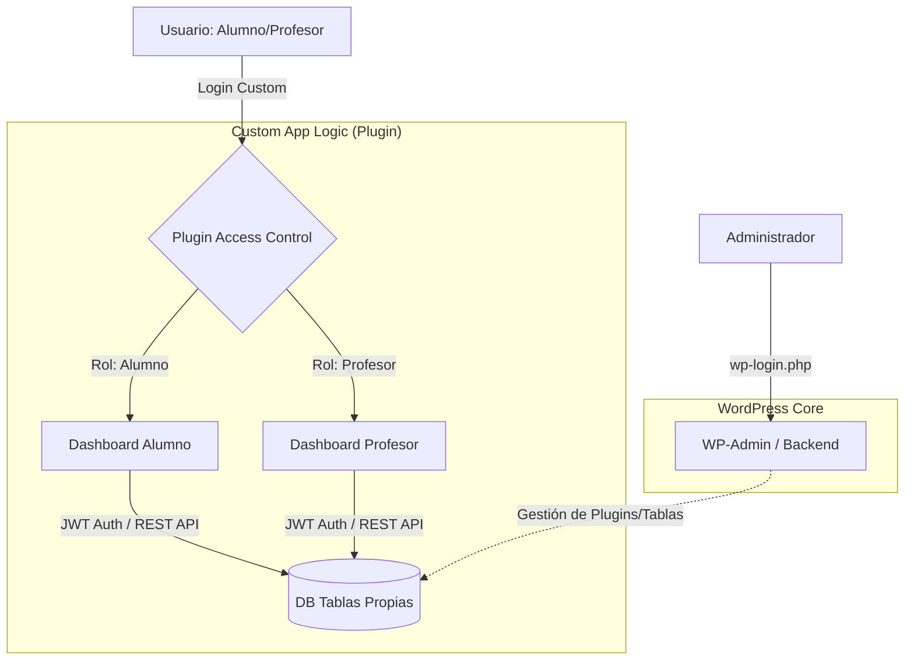
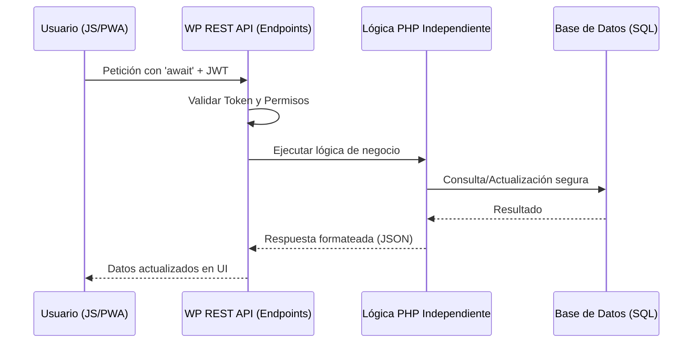

# 🛡️ Plataforma de Gestión Segura para Autoescuelas

> **Rol:** Desarrollador Principal (Full Stack) 

> [!SUCCESS] Impacto de Negocio
> **Automatización total:** El sistema eliminó la necesidad de una persona dedicada a gestión manual, logrando un ahorro operativo directo y una gestión 100% en la nube.

Este proyecto consistió en el desarrollo de un ecosistema modular para la gestión de clases prácticas, diseñado para operar de forma independiente al núcleo administrativo de WordPress, garantizando la integridad de los datos y la privacidad de los usuarios.

---

## 📊 Arquitectura de Autenticación y Control de Acceso

Para este proyecto, se implementó una separación lógica entre la gestión administrativa y la experiencia del usuario final:

- **Acceso Administrativo:** Se mantiene el flujo nativo de WordPress (`wp-login.php`) para el administrador, garantizando total compatibilidad con el Core y protegiendo el acceso al backend.

- **Acceso de Usuarios (Frontend):** Se desarrolló un controlador de acceso personalizado mediante un plugin que gestiona roles específicos (Alumno/Profesor). Este flujo utiliza autenticación basada en **JWT (JSON Web Tokens)** para comunicarse de forma segura con tablas personalizadas en la base de datos, optimizando el rendimiento al no depender exclusivamente de `wp_usermeta`.

- **Seguridad:** Al desacoplar el login del administrador del sistema de usuarios del plugin, reducimos la superficie de ataque y permitimos una escalabilidad independiente de la interfaz de usuario.

---

## 💻 Stack Tecnológico y Capacidades

> [!simple]- **WordPress REST API**
> - **Uso:** Creación de endpoints personalizados para todas las funcionalidades de la plataforma.
> - **Enfoque de Seguridad:** Implementación de control de acceso granular y protección activa contra ataques de fuerza bruta en los puntos de entrada.

> [!simple]- **PHP (Lógica Independiente)**
> - **Uso:** Procesamiento de la lógica de negocio y gestión de clases en el lado del servidor (POO).
> - **Enfoque de Seguridad:** Validación estricta de esquemas, sanitización de inputs y prevención de inyecciones SQL mediante consultas preparadas.

> [!simple]- **JavaScript (ES6+)**
> - **Uso:** Consumo de la API mediante `async/await` para una experiencia de usuario fluida y reactiva.
> - **Enfoque de Seguridad:** Gestión segura de tokens en el cliente y saneamiento de datos antes del envío al servidor.

> [!simple]- **JSON Web Tokens (JWT)**
> - **Uso:** Autenticación y manejo de sesiones en las rutas críticas (`/alumno` y `/profesor`).
> - **Enfoque de Seguridad:** Sesiones sin estado (*stateless*) que reducen la superficie de ataque y protección de rutas mediante firmas criptográficas.

> [!simple]- **Progressive Web App (PWA)**
> - **Uso:** Interfaz móvil nativa para que alumnos y profesores gestionen sus clases.
> - **Enfoque de Seguridad:** Canal de notificaciones optimizado (OneSignal) y mejora de la disponibilidad del servicio.

> [!simple]- **GitHub & Workflow**
> - **Uso:** Control de versiones y flujo de trabajo basado en ramas (*feature branches*).
> - **Enfoque de Seguridad:** Ciclo de vida de desarrollo seguro (SDLC) con entorno de *Staging* para validación previa al despliegue.
---

## 🔒 Aspectos Clave de Ciberseguridad

Aunque era un proyecto de desarrollo, se aplicaron principios de **seguridad por diseño**:

1. **Control de Acceso Basado en Roles (RBAC):** Implementación de roles específicos para evitar la exposición de datos sensibles entre profesores y alumnos.

2. **Reducción de Superficie de Ataque:** Se crearon rutas personalizadas fuera del `wp-admin`, impidiendo que los usuarios finales (profesores/alumnos) tuvieran contacto con el panel de administración del CMS.

3. **Gestión de Sesiones con JWT:** Asegurando que cada interacción con la base de datos estuviera legitimada mediante tokens firmados.

4. **Entorno de Staging:** Uso de flujos de trabajo en GitHub y sitios de prueba para validar cambios antes del despliegue en producción, minimizando riesgos de disponibilidad.

5. **Seguridad en la Capa de API:** * Implementé una arquitectura basada en **endpoints personalizados**, lo que permitió desacoplar la lógica de presentación de la lógica de datos.
    - Cada llamada a la API pasaba por un filtro de autenticación y autorización (usando los roles personalizados y JWT), asegurando que ningún usuario pudiera ejecutar funciones o consultar datos fuera de su ámbito de permisos (_IDOR prevention_).

---

## 🚀 Impacto de Negocio y Validación

- **Eficiencia Operativa:** El sistema automatizó la agenda de clases (FullCalendar JS), eliminando la necesidad de una persona dedicada a la gestión telefónica y manual de horarios.

- **Ahorro de Costes:** La empresa logró prescindir de un puesto administrativo, delegando esa carga de trabajo al software.

- **Escalabilidad:** Diseñado de forma totalmente modular para ser comercializado como una solución independiente (SaaS).

- **Feedback del Cliente:** Operativo con éxito de junio a septiembre de 2025, cumpliendo los plazos críticos de entrega.

