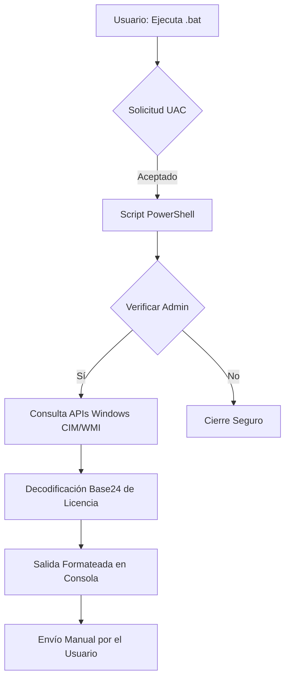

# Auditoría de Activos: Puesto de Trabajo Seguro

> - **Rol:** Desarrollador y Responsable de Automatización 
> - **Contexto:** Herramienta diseñada para **Cubetic Consultores** dentro del programa **Kit Digital**.

> [!SUCCESS] Valor de Negocio y Cumplimiento 
> **Impacto Real:** Herramienta utilizada en la auditoría de **más de 60 equipos**, con una vida útil proyectada hasta octubre de 2026. Asegura el cumplimiento de los requisitos de subvención mediante la eliminación de errores manuales en la recolección de licencias.

Esta herramienta autocontenida permite recolectar el serial de BIOS, la clave OEM de Windows y la versión del SO de forma rápida y segura, operando sin conexión y sin dependencias externas.

---

## ⚙️ Arquitectura y Flujo de Ejecución

El diseño prioriza la **transparencia técnica** y la facilidad de uso para personal no técnico.

---

## 🛠️ Stack Tecnológico

- **Lenguajes:** PowerShell 5.1+ y Batch (CMD).

- **APIs de Windows:** Uso de `CIM/WMI` (`Win32_BIOS`, `Win32_OperatingSystem`) para acceso directo al hardware.

- **Automatización:** CI/CD mediante **GitHub Actions** para el empaquetado y versionado automático de cada release.

---

## 🔒 Decisiones de Diseño y Seguridad

> [!simple]- **Transparencia y Agilidad (Batch + PowerShell)**
> 
> - **Reto:** Evitar la fricción administrativa de los certificados empresariales.
>     
> - **Solución:** Elegí usar la combinación de `.bat` y `.ps1` en lugar de un `.exe` para evitar retrasos en la validación de certificados de software. Además, este formato permite que el código sea auditable y transparente para cualquier técnico, evitando falsos positivos de antivirus.
>     

> [!simple]- **Transferencia de Datos "Air-gapped"**
> 
> - **Reto:** Evitar la exfiltración automática de identificadores sensibles.
>     
> - **Solución:** La herramienta opera sin conexión; los datos se muestran localmente para que el usuario los envíe manualmente, garantizando la privacidad y el consentimiento en cada paso.
>     

> [!simple]- **Ingeniería de Reversa de Licencias**
> 
> - **Reto:** Las claves OEM digitales no siempre son legibles de forma directa.
>     
> - **Solución:** Implementación de un algoritmo de **decodificación Base24** que traduce el `DigitalProductId` del registro en la clave original de 25 caracteres, asegurando un inventario de licencias fidedigno.

---

## Medios

En el siguiente enlace la página de explicación de la herramienta, destinada a usuarios no técnicos.

> [Enlace](https://cubetic.github.io/info-puesto-seguro/)